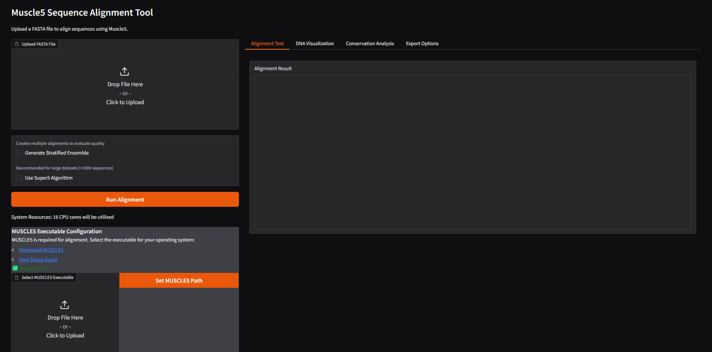
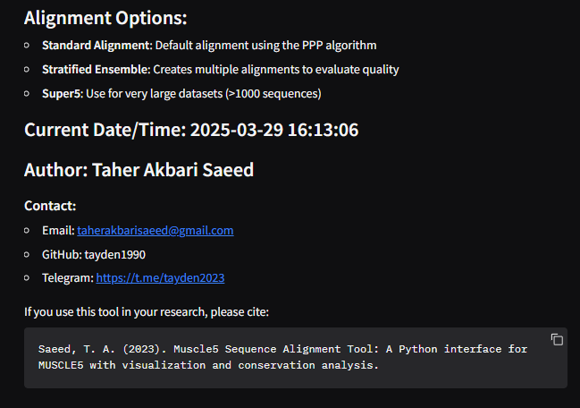
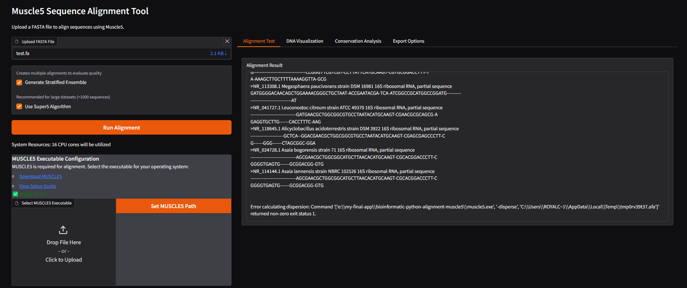
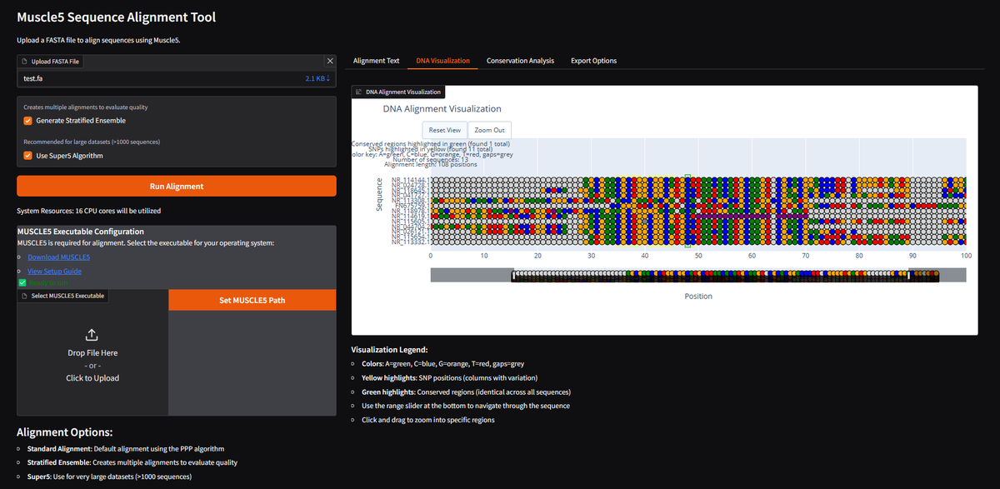
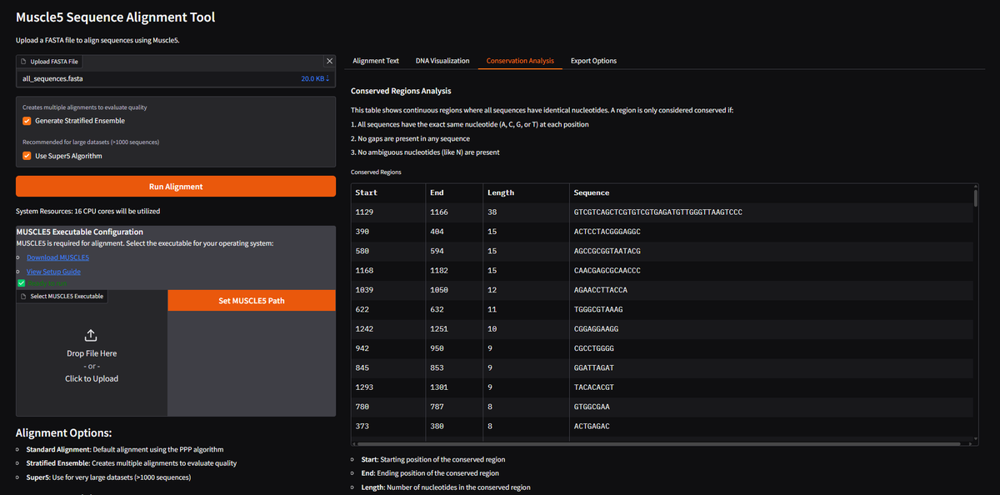
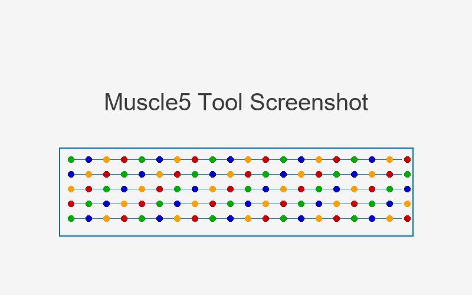

# Muscle5 Sequence Alignment Tool

A Python-based graphical interface for the MUSCLE5 multiple sequence alignment algorithm with advanced visualization and analysis capabilities.

## Screenshots

<div align="center">
  <table>
    <tr>
      <td></td>
      <td></td>
    </tr>
    <tr>
      <td align="center"><b>Main Interface</b></td>
      <td align="center"><b>Alignment Options</b></td>
    </tr>
    <tr>
      <td></td>
      <td></td>
    </tr>
    <tr>
      <td align="center"><b>Alignment Results</b></td>
      <td align="center"><b>DNA Visualization</b></td>
    </tr>
    <tr>
      <td></td>
      <td></td>
    </tr>
    <tr>
      <td align="center"><b>Conservation Analysis</b></td>
      <td align="center"><b>Export Options</b></td>
    </tr>
  </table>
</div>

<details>
<summary>Additional environment setup screenshots</summary>
<div align="center">
  <table>
    <tr>
      <td></td>
      <td></td>
      <td></td>
    </tr>
    <tr>
      <td align="center"><b>Windows Setup</b></td>
      <td align="center"><b>Mac Setup</b></td>
      <td align="center"><b>Linux Setup</b></td>
    </tr>
  </table>
</div>
</details>

## Features

- **Powerful Sequence Alignment**: Harness the power of MUSCLE5, a state-of-the-art multiple sequence alignment algorithm
- **Interactive Visualization**: Visualize alignments with color-coded nucleotides, SNP highlighting, and conserved region identification
- **Conservation Analysis**: Automatically identify and analyze conserved regions across sequences
- **Multiple Export Formats**: Export alignments in various formats (FASTA, Clustal, PHYLIP, NEXUS, Stockholm)
- **Stratified Ensemble Support**: Generate and analyze multiple alignments to evaluate quality
- **Super5 Algorithm**: Special support for very large datasets (>1000 sequences)

## Installation

### Prerequisites

- Python 3.8+ 
- MUSCLE5 executable ([available here](https://drive5.com/muscle/))

### Setup

1. Clone this repository:
```bash
git clone https://github.com/tayden1990/bioinformatic-python-alignment-muscle5.git
cd bioinformatic-python-alignment-muscle5
```

2. Install required dependencies:
```bash
pip install -r requirements.txt
```

3. Download and install MUSCLE5:

   **For Windows:**
   - Download from [drive5.com/muscle](https://drive5.com/muscle/)
   - Choose the Windows executable (muscle5.1.win64.exe)
   - Save it to a location on your computer (e.g., `C:\Program Files\muscle5\`)
   - Rename the file to `muscle5.exe` for convenience
   - Add the folder to your PATH environment variable or provide the full path in the configuration

   **For Mac:**
   - Download from [drive5.com/muscle](https://drive5.com/muscle/)
   - Choose the Mac executable (muscle5.1.macos_intel64)
   - Save it to a location on your computer (e.g., `/usr/local/bin/`)
   - Make it executable: `chmod +x /usr/local/bin/muscle5.1.macos_intel64`
   - Create a symlink: `ln -s /usr/local/bin/muscle5.1.macos_intel64 /usr/local/bin/muscle5`

   **For Linux:**
   - Download from [drive5.com/muscle](https://drive5.com/muscle/)
   - Choose the Linux executable (muscle5.1.linux_intel64)
   - Save it to a location on your computer (e.g., `/usr/local/bin/`)
   - Make it executable: `chmod +x /usr/local/bin/muscle5.1.linux_intel64`
   - Create a symlink: `ln -s /usr/local/bin/muscle5.1.linux_intel64 /usr/local/bin/muscle5`

4. Configure MUSCLE5 path in the application:

   **Option 1:** Update the configuration file
   - Open `config.py` in your favorite text editor
   - Update the `MUSCLE5_PATH` variable:
     ```python
     # Windows example
     MUSCLE5_PATH = "C:/Program Files/muscle5/muscle5.exe"
     
     # Mac/Linux example
     MUSCLE5_PATH = "/usr/local/bin/muscle5"
     ```

   **Option 2:** Set via environment variable
   - Set the `MUSCLE5_PATH` environment variable to point to your MUSCLE5 executable
     ```bash
     # Windows (Command Prompt)
     set MUSCLE5_PATH=C:\Program Files\muscle5\muscle5.exe
     
     # Windows (PowerShell)
     $env:MUSCLE5_PATH = "C:\Program Files\muscle5\muscle5.exe"
     
     # Mac/Linux
     export MUSCLE5_PATH=/usr/local/bin/muscle5
     ```

   **Option 3:** Specify during application startup
   - Launch the application with the path parameter:
     ```bash
     python app.py --muscle-path="/path/to/muscle5"
     ```

5. Verify MUSCLE5 installation:
   ```bash
   # Windows
   "C:\Program Files\muscle5\muscle5.exe" -version
   
   # Mac/Linux
   /usr/local/bin/muscle5 -version
   ```
   You should see the MUSCLE5 version information if properly installed.

## Usage

Run the application:

```bash
python app.py
```

The web interface will be available at http://127.0.0.1:7860/

### Basic Workflow:

1. Upload a FASTA file containing DNA sequences
2. Choose alignment options:
   - **Standard Alignment**: Default for most datasets
   - **Stratified Ensemble**: Creates multiple alignments to evaluate quality
   - **Super5**: Use for very large datasets (>1000 sequences)
3. Click "Run Alignment"
4. View results in different tabs:
   - **Alignment Text**: Raw alignment output
   - **DNA Visualization**: Interactive visualization of the alignment
   - **Conservation Analysis**: Table of conserved regions
   - **Export Options**: Export aligned sequences in various formats

<details>
<summary>See screenshot of user interface</summary>



</details>

### Advanced Usage

#### Command-line Options

The application supports several command-line options:

```bash
python app.py --help
```

Common options:
- `--port=8080`: Run the web interface on a different port
- `--muscle-path="/path/to/muscle5"`: Specify MUSCLE5 executable path
- `--no-browser`: Don't automatically open a browser window
- `--debug`: Run in debug mode with additional logging

#### Using MUSCLE5 Directly

You can also use MUSCLE5 directly from the command line:

```bash
# Basic alignment
muscle5 -align input.fasta -output aligned.fasta

# With stratified ensemble (higher quality)
muscle5 -align input.fasta -output aligned.fasta -stratified

# For very large datasets
muscle5 -super5 input.fasta -output aligned.fasta
```

## Example Data

Sample FASTA files are provided in the `example_data` directory to help you get started.

## Troubleshooting

### Common Issues

1. **"MUSCLE5 executable not found"**:
   - Ensure the path to MUSCLE5 is correctly specified
   - Verify that the file exists and is executable

2. **"Permission denied" when running MUSCLE5**:
   - On Mac/Linux: `chmod +x /path/to/muscle5`
   - On Windows: Run as administrator or check antivirus settings

3. **Application crashes during alignment**:
   - Check if your input sequences are valid
   - Ensure you have sufficient memory for large sequence sets
   - Check the log file at `logs/app.log` for detailed error messages

### Getting Help

If you encounter issues not covered in the troubleshooting section, please:
1. Check the [GitHub Issues](https://github.com/tayden1990/bioinformatic-python-alignment-muscle5/issues)
2. Open a new issue with detailed information about your problem
3. Contact the developer using the information in the Contact section

## Deployment

### Run in GitHub Codespaces (No Installation Required!)

You can run this application directly in your browser using GitHub Codespaces without installing anything locally:

1. Click the green "Code" button at the top of this repository
2. Select the "Codespaces" tab
3. Click "Create codespace on main"
4. Once the environment loads, run:
   ```bash
   python app.py
   ```
5. Click the "Open in Browser" notification when the Gradio interface starts

For detailed instructions, see the [GitHub Codespaces Guide](GITHUB_CODESPACES.md).

### Publishing to GitHub

Follow these steps to publish your own version of this tool to GitHub:

1. Create a new repository on GitHub
2. Initialize Git in your local project folder:
   ```bash
   git init
   git add .
   git commit -m "Initial commit"
   ```
3. Connect your local repository to GitHub:
   ```bash
   git remote add origin https://github.com/yourusername/your-repo-name.git
   git branch -M main
   git push -u origin main
   ```

4. GitHub Actions is already configured in `.github/workflows/tests.yml` and will automatically run tests on push

### Docker Deployment

You can also deploy this application using Docker:

```bash
# Build the Docker image
docker build -t muscle5-app .

# Run the container
docker run -p 7860:7860 muscle5-app
```

## Citation

If you use this tool in your research, please cite:

```
AkbariSaeed, T. (2023). Muscle5 Sequence Alignment Tool: A Python interface for MUSCLE5 with 
visualization and conservation analysis. GitHub: https://github.com/tayden1990/bioinformatic-python-alignment-muscle5
```

## Contact

- **Email**: taherakbarisaeed@gmail.com
- **GitHub**: tayden1990
- **Telegram**: https://t.me/tayden2023

## License

This project is licensed under the MIT License - see the [LICENSE](LICENSE) file for details.

## Acknowledgments

- Robert C. Edgar for creating the MUSCLE algorithm
- The Biopython team for providing essential bioinformatics tools
- Gradio team for the interactive web interface framework
