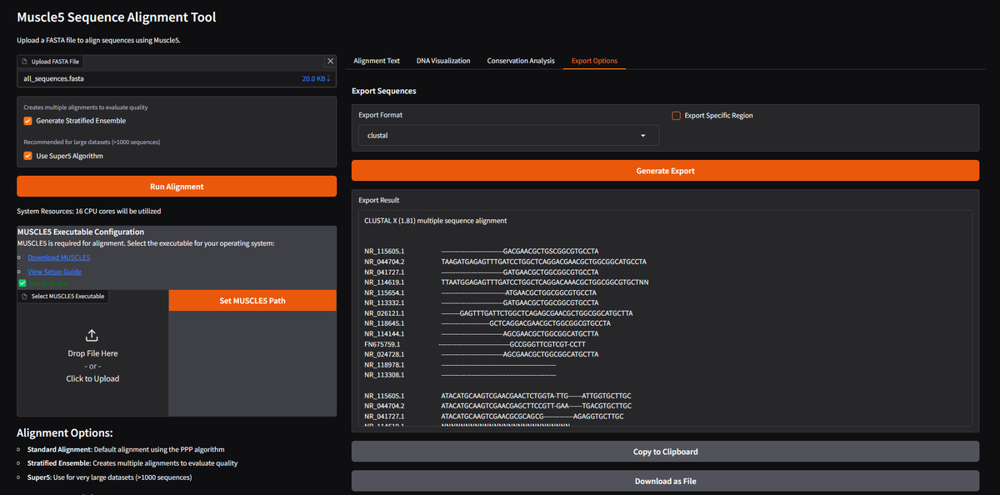

# Muscle5 Sequence Alignment Tool

A Python-based graphical interface for the MUSCLE5 multiple sequence alignment algorithm with advanced visualization and analysis capabilities.

## Overview

The Muscle5 Sequence Alignment Tool provides a user-friendly graphical interface to MUSCLE5 (MUltiple Sequence Comparison by Log-Expectation), one of the most powerful and accurate algorithms for multiple sequence alignment in bioinformatics. This tool bridges the gap between command-line bioinformatics tools and researchers by providing an intuitive web interface with advanced visualization capabilities.

### What is Multiple Sequence Alignment?

Multiple Sequence Alignment (MSA) is a fundamental technique in bioinformatics that arranges biological sequences (DNA, RNA, or protein) to identify regions of similarity. These similarities may be consequences of functional, structural, or evolutionary relationships between the sequences. MSA is essential for:

- Identifying conserved domains and motifs
- Constructing phylogenetic trees
- Predicting protein structure and function
- Analyzing genetic variations (SNPs, insertions, deletions)
- Designing PCR primers and probes
- Guiding CRISPR-Cas9 targeting

### Why MUSCLE5?

MUSCLE5 represents a significant advancement over previous alignment algorithms with:

- Higher accuracy compared to other popular alignment tools
- Faster performance for large datasets
- Advanced ensemble-based methods that provide statistical confidence measures
- Superior handling of divergent sequences
- Efficient memory usage for very large alignments

## Screenshots

<div align="center">
  <table>
    <tr>
      <td></td>
      <td></td>
    </tr>
    <tr>
      <td align="center"><b>Main Page Interface</b></td>
      <td align="center"><b>Alignment Options</b></td>
    </tr>
    <tr>
      <td></td>
      <td></td>
    </tr>
    <tr>
      <td align="center"><b>Alignment Results</b></td>
      <td align="center"><b>DNA Visualization</b></td>
    </tr>
    <tr>
      <td></td>
      <td></td>
    </tr>
    <tr>
      <td align="center"><b>Conservation Analysis</b></td>
      <td align="center"><b>Export Options</b></td>
    </tr>
  </table>
</div>

## Features

- **Powerful Sequence Alignment**: Harness the power of MUSCLE5, a state-of-the-art multiple sequence alignment algorithm
  - Implements the PPP (Progressive, Progressive, Progressive) algorithm for high accuracy
  - Optimized for both closely and distantly related sequences
  - Automated parameter selection based on dataset characteristics

- **Interactive Visualization**: Rich, interactive alignment visualization
  - Color-coded nucleotides for easy pattern recognition (A=green, C=blue, G=orange, T=red)
  - Automatic SNP highlighting to identify variations between sequences
  - Conserved region identification with region-specific analysis
  - Zoomable and navigable interface for exploring large alignments
  - Customizable display with sequence labels and position indicators

- **Conservation Analysis**: Comprehensive analysis of sequence conservation
  - Automatic identification of conserved regions across all sequences
  - Quantitative assessment of conservation by region
  - Tabular display of conserved regions with start, end, length, and sequence
  - Prioritization of regions by conservation length
  - Detection of potential functional motifs based on conservation patterns

- **Advanced Algorithmic Options**:
  - **Stratified Ensemble Support**: Generate multiple alignments to assess alignment quality
    - Statistical confidence measures for aligned positions
    - Dispersion analysis to evaluate alignment stability
    - Identification of regions with alignment uncertainty
  - **Super5 Algorithm**: Specialized algorithm for very large datasets
    - Efficient processing of alignments with >1000 sequences
    - Reduced memory footprint for large genomic datasets
    - Maintains accuracy while dramatically improving performance

- **Comprehensive Export Capabilities**:
  - Export complete alignments or specific regions of interest
  - Multiple format support (FASTA, Clustal, PHYLIP, NEXUS, Stockholm)
  - Format-specific optimization for downstream analysis
  - Direct integration with other bioinformatics tools

- **High-Performance Computing Integration**:
  - Automatic detection and utilization of available CPU cores
  - Memory optimization for large sequence datasets
  - Progress tracking for long-running alignments
  - Error handling with informative diagnostic messages

- **Cross-Platform Compatibility**:
  - Runs on Windows, macOS, and Linux
  - Cloud deployment support via Docker and GitHub Codespaces
  - Consistent interface across all platforms

## Installation

### Prerequisites

- Python 3.8+ 
- MUSCLE5 executable ([available here](https://drive5.com/muscle5/))

### Setup

1. Clone this repository:
```bash
git clone https://github.com/tayden1990/bioinformatic-python-alignment-muscle5.git
cd bioinformatic-python-alignment-muscle5
```

2. Install required dependencies:
```bash
pip install -r requirements.txt
```

3. Download and install MUSCLE5:

   **For Windows:**
   - Download from [drive5.com/muscle5](https://drive5.com/muscle5/)
   - Choose the Windows executable (muscle5.1.win64.exe)
   - Save it to a location on your computer (e.g., `C:\Program Files\muscle5\`)
   - Rename the file to `muscle5.exe` for convenience (optional)
   - Add the folder to your PATH environment variable or provide the full path in the configuration

   **For Mac:**
   - Download from [drive5.com/muscle5](https://drive5.com/muscle5/)
   - Choose the Mac executable (muscle5.1.macos_intel64 or muscle5.1.macos_arm64)
   - Save it to a location on your computer (e.g., `/usr/local/bin/`)
   - Make it executable: `chmod +x /usr/local/bin/muscle5.1.macos_intel64`
   - Create a symlink: `ln -s /usr/local/bin/muscle5.1.macos_intel64 /usr/local/bin/muscle5`

   **For Linux:**
   - Download from [drive5.com/muscle5](https://drive5.com/muscle5/)
   - Choose the Linux executable (muscle5.1.linux_intel64)
   - Save it to a location on your computer (e.g., `/usr/local/bin/`)
   - Make it executable: `chmod +x /usr/local/bin/muscle5.1.linux_intel64`
   - Create a symlink: `ln -s /usr/local/bin/muscle5.1.linux_intel64 /usr/local/bin/muscle5`

4. Configure MUSCLE5 path in the application:

   **Option 1:** Update the configuration file
   - Open `config.py` in your favorite text editor
   - Update the `MUSCLE5_PATH` variable:
     ```python
     # Windows example
     MUSCLE5_PATH = "C:/Program Files/muscle5/muscle5.exe"
     
     # Mac/Linux example
     MUSCLE5_PATH = "/usr/local/bin/muscle5"
     ```

   **Option 2:** Set via environment variable
   - Set the `MUSCLE5_PATH` environment variable to point to your MUSCLE5 executable
     ```bash
     # Windows (Command Prompt)
     set MUSCLE5_PATH=C:\Program Files\muscle5\muscle5.exe
     
     # Windows (PowerShell)
     $env:MUSCLE5_PATH = "C:\Program Files\muscle5\muscle5.exe"
     
     # Mac/Linux
     export MUSCLE5_PATH=/usr/local/bin/muscle5
     ```

   **Option 3:** Specify during application startup
   - Launch the application with the path parameter:
     ```bash
     python app.py --muscle-path="/path/to/muscle5"
     ```

5. Verify MUSCLE5 installation:
   ```bash
   # Windows
   "C:\Program Files\muscle5\muscle5.exe" -version
   
   # Mac/Linux
   /usr/local/bin/muscle5 -version
   ```
   You should see the MUSCLE5 version information if properly installed.

## Usage

Run the application:

```bash
python app.py
```

The web interface will be available at http://127.0.0.1:7860/

### Basic Workflow:

1. Upload a FASTA file containing DNA sequences
2. Choose alignment options:
   - **Standard Alignment**: Default for most datasets
   - **Stratified Ensemble**: Creates multiple alignments to evaluate quality
   - **Super5**: Use for very large datasets (>1000 sequences)
3. Click "Run Alignment"
4. View results in different tabs:
   - **Alignment Text**: Raw alignment output
   - **DNA Visualization**: Interactive visualization of the alignment
   - **Conservation Analysis**: Table of conserved regions
   - **Export Options**: Export aligned sequences in various formats

<details>
<summary>See screenshot of user interface</summary>


</details>

### Detailed Usage Guide

#### Preparing Input Data

The tool accepts FASTA format sequence files containing nucleotide (DNA/RNA) sequences. Each sequence in the FASTA file should:
- Begin with a ">" character followed by a unique identifier/description
- Contain valid nucleotide characters (A, C, G, T/U, and occasionally ambiguity codes)

Example of a valid FASTA file:
```
>Sequence1_Identifier
ATGCGTACGATCGATCGATCGCTAGCTAGCTGACGTATCGATCG
>Sequence2_Identifier
ATGCGTACGTTCGATCGATCGCTAGCTAGCTGACGTATCGATCG
```

For best results:
- Remove any non-nucleotide characters or whitespace
- Ensure each sequence has a unique, descriptive identifier
- For comparative analysis, sequences should be from homologous regions
- Pre-trim sequences to remove low-quality ends if applicable

#### Choosing the Right Alignment Method

**Standard Alignment (PPP Algorithm):**
- Recommended for most datasets with <1000 sequences
- Balances speed and accuracy
- Works well for sequences with moderate similarity (~40-90% identity)
- Use when analyzing a typical set of variant sequences or closely related genes

**Stratified Ensemble:**
- Recommended when alignment quality assessment is important
- Creates multiple alignments and evaluates consistency between them
- Provides statistical confidence measures for aligned positions
- Use for:
  - Phylogenetic analysis where alignment quality impacts tree topology
  - Detecting subtle sequence patterns in moderately divergent sequences
  - Identifying regions of alignment uncertainty
  - Publication-quality alignments requiring confidence metrics

**Super5 Algorithm:**
- Recommended for very large datasets (>1000 sequences)
- Optimized for memory efficiency with large alignments
- Maintains accuracy while significantly reducing computational requirements
- Use for:
  - Metagenomic dataset analysis
  - Pan-genome comparisons
  - Large-scale variant analysis
  - Whole-genome alignments of related species

#### Analyzing Alignment Results

**Alignment Text Tab:**
- Shows raw alignment output in standard FASTA format
- Useful for:
  - Inspecting exact positioning of indels (insertions/deletions)
  - Copying raw alignment data for external tools
  - Verifying alignment completion and success

**DNA Visualization Tab:**
- Interactive color-coded representation of the alignment
- Yellow highlighting indicates SNPs (Single Nucleotide Polymorphisms)
- Green highlighting shows conserved regions
- Features:
  - Zoom in/out to examine specific regions
  - Hover over bases to see position and nucleotide information
  - Sequence names displayed on the left for reference
  - Navigation slider to move through long alignments

**Conservation Analysis Tab:**
- Tabular display of conserved regions sorted by length
- Each row represents a continuous conserved region with:
  - Start position (1-based indexing)
  - End position
  - Length of conservation
  - Actual conserved sequence
- Useful for:
  - Identifying functional motifs and domains
  - Designing PCR primers in conserved regions
  - Locating potential regulatory elements
  - Targeting regions for further experimental analysis

**Export Options Tab:**
- Convert alignments to various formats for downstream analysis
- Format options:
  - **FASTA**: Most common format, compatible with nearly all bioinformatics tools
  - **Clustal**: Emphasizes conservation with consensus sequence and conservation symbols
  - **PHYLIP**: Optimized for phylogenetic software like RAxML, PhyML
  - **NEXUS**: Enhanced format for evolutionary analysis programs like MrBayes, BEAST
  - **Stockholm**: Standard format for RNA analysis and compatible with Rfam
- Region selection allows exporting only portions of interest
- Direct download or clipboard copy options

#### Advanced Use Cases

**Viral Sequence Analysis:**
- Upload multiple viral strain sequences (e.g., SARS-CoV-2 variants)
- Use Standard Alignment or Stratified Ensemble
- Examine SNPs in the Visualization tab to identify key mutations
- Create exportable tables of conserved regions for primer design
- Export in FASTA format for phylogenetic analysis or GISAID submission

**Bacterial Gene Family Analysis:**
- Upload homologous genes from multiple bacterial species
- Use Stratified Ensemble for divergent sequences
- Identify conserved domains that may indicate functional importance
- Export specific regions in NEXUS format for evolutionary analysis
- Use conservation data to guide site-directed mutagenesis experiments

**Large Dataset Processing:**
- Upload thousands of sequences from metagenomic studies
- Use Super5 algorithm for efficient processing
- Examine overall conservation patterns across the large dataset
- Export in compatible formats for taxonomic classification
- Identify consensus sequences for representative analysis

**Primer Design Workflow:**
- Align target sequences from multiple strains/species
- Use Visualization tab to identify regions with high conservation
- Switch to Conservation Analysis to get exact coordinates and sequences
- Export conserved regions for verification in primer design tools
- Test primers against the full alignment to check coverage

### Advanced Usage

#### Command-line Options

The application supports several command-line options:

```bash
python app.py --help
```

Common options:
- `--port=8080`: Run the web interface on a different port
- `--muscle-path="/path/to/muscle5"`: Specify MUSCLE5 executable path
- `--no-browser`: Don't automatically open a browser window
- `--debug`: Run in debug mode with additional logging

#### Using MUSCLE5 Directly

You can also use MUSCLE5 directly from the command line:

```bash
# Basic alignment
muscle5 -align input.fasta -output aligned.fasta

# With stratified ensemble (higher quality)
muscle5 -align input.fasta -output aligned.fasta -stratified

# For very large datasets
muscle5 -super5 input.fasta -output aligned.fasta
```

#### Integration with Other Bioinformatics Tools

This tool works seamlessly with other bioinformatics software:

**Phylogenetic Analysis Workflow:**
1. Align sequences using Muscle5 Sequence Alignment Tool
2. Export in PHYLIP format
3. Build phylogenetic trees using RAxML, IQ-TREE, or PhyML
4. Visualize trees with FigTree or iTOL

**Primer Design Pipeline:**
1. Align target sequences with Muscle5 Sequence Alignment Tool
2. Identify conserved regions using Conservation Analysis
3. Export regions to Primer3 or PrimerBLAST
4. Verify primer specificity with electronic PCR

**Metagenomics Classification:**
1. Align unknown sequences with reference database using Super5
2. Export alignment in compatible format
3. Use Kraken2, MEGAN, or other classification tools
4. Visualize taxonomic assignments

## Example Data

Sample FASTA files are provided in the `example_data` directory to help you get started.

- `example.fasta`: Small set of 5 sequences for testing basic functionality
- `covid_variants.fasta`: SARS-CoV-2 variant sequences for comparing mutations

### Example Analysis Walkthrough

**COVID-19 Variant Analysis:**
1. Load `covid_variants.fasta` from the example_data directory
2. Select "Stratified Ensemble" for higher confidence alignment
3. Run the alignment
4. In the Visualization tab, observe the highlighted SNPs that indicate mutations
5. Switch to Conservation Analysis to identify regions conserved across all variants
6. Export the alignment in FASTA format for further analysis

## Troubleshooting

### Common Issues

1. **"MUSCLE5 executable not found"**:
   - Ensure the path to MUSCLE5 is correctly specified
   - Verify that the file exists and is executable

2. **"Permission denied" when running MUSCLE5**:
   - On Mac/Linux: `chmod +x /path/to/muscle5`
   - On Windows: Run as administrator or check antivirus settings

3. **Application crashes during alignment**:
   - Check if your input sequences are valid
   - Ensure you have sufficient memory for large sequence sets
   - Check the log file at `logs/app.log` for detailed error messages

### Getting Help

If you encounter issues not covered in the troubleshooting section, please:
1. Check the [GitHub Issues](https://github.com/tayden1990/bioinformatic-python-alignment-muscle5/issues)
2. Open a new issue with detailed information about your problem
3. Contact the developer using the information in the Contact section

## Deployment

### Run in GitHub Codespaces (No Installation Required!)

You can run this application directly in your browser using GitHub Codespaces without installing anything locally:

1. Click the green "Code" button at the top of this repository
2. Select the "Codespaces" tab
3. Click "Create codespace on main"
4. Once the environment loads, run:
   ```bash
   python app.py
   ```
5. Click the "Open in Browser" notification when the Gradio interface starts

For detailed instructions, see the [GitHub Codespaces Guide](GITHUB_CODESPACES.md).

### Publishing to GitHub

Follow these steps to publish your own version of this tool to GitHub:

1. Create a new repository on GitHub
2. Initialize Git in your local project folder:
   ```bash
   git init
   git add .
   git commit -m "Initial commit"
   ```
3. Connect your local repository to GitHub:
   ```bash
   git remote add origin https://github.com/yourusername/your-repo-name.git
   git branch -M main
   git push -u origin main
   ```

4. GitHub Actions is already configured in `.github/workflows/tests.yml` and will automatically run tests on push

### Docker Deployment

You can also deploy this application using Docker:

```bash
# Build the Docker image
docker build -t muscle5-app .

# Run the container
docker run -p 7860:7860 muscle5-app
```

## Citation

If you use this tool in your research, please cite:

```
AkbariSaeed, T. (2023). Muscle5 Sequence Alignment Tool: A Python interface for MUSCLE5 with 
visualization and conservation analysis. GitHub: https://github.com/tayden1990/bioinformatic-python-alignment-muscle5
```

## Contact

- **Email**: taherakbarisaeed@gmail.com
- **GitHub**: tayden1990
- **Telegram**: https://t.me/tayden2023

## License

This project is licensed under the MIT License - see the [LICENSE](LICENSE) file for details.

## Acknowledgments

- Robert C. Edgar for creating the MUSCLE algorithm
- The Biopython team for providing essential bioinformatics tools
- Gradio team for the interactive web interface framework
