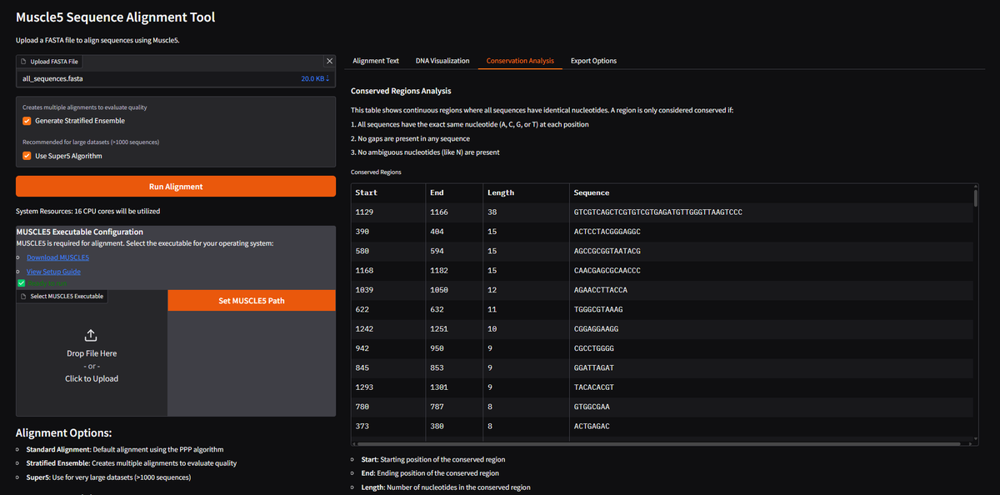

# Muscle5 Sequence Alignment Tool Screenshot Gallery

This document showcases screenshots of the Muscle5 Sequence Alignment Tool interface and functionality.

## Screenshot Gallery

<div align="center">
  <table>
    <tr>
      <td></td>
      <td></td>
    </tr>
    <tr>
      <td align="center"><b>Main Page Interface</b></td>
      <td align="center"><b>Alignment Options</b></td>
    </tr>
    <tr>
      <td></td>
      <td></td>
    </tr>
    <tr>
      <td align="center"><b>Alignment Results</b></td>
      <td align="center"><b>DNA Visualization</b></td>
    </tr>
    <tr>
      <td></td>
      <td></td>
    </tr>
    <tr>
      <td align="center"><b>Conservation Analysis</b></td>
      <td align="center"><b>Export Options</b></td>
    </tr>
  </table>
</div>

## Feature Highlights

### DNA Visualization

The DNA Visualization interface provides an interactive view of the aligned sequences with:
- Color-coded nucleotides (A=green, C=blue, G=orange, T=red, gaps=grey)
- Automatic SNP highlighting in yellow to identify variations between sequences
- Conserved region highlighting in green
- Zoomable and navigable interface for exploring large alignments


### Conservation Analysis

The Conservation Analysis tab shows:
- Tabular display of conserved regions with start, end, length, and sequence
- Prioritization of regions by conservation length
- Detection of potential functional motifs based on conservation patterns


### Export Options

The Export Options interface allows:
- Exporting complete alignments or specific regions of interest
- Multiple format support (FASTA, Clustal, PHYLIP, NEXUS, Stockholm)
- Direct download or clipboard copy functionality


### Alignment Results

The Alignment Results view shows:
- Complete aligned sequences in standard sequence format
- Sequence metadata and properties
- Alignment statistics and quality metrics


## Using These Screenshots

These screenshots can be used in documentation, presentations, or publications about the Muscle5 Sequence Alignment Tool. When using them, please attribute them properly:

```
Screenshots from Muscle5 Sequence Alignment Tool by Taher Akbari Saeed
```
